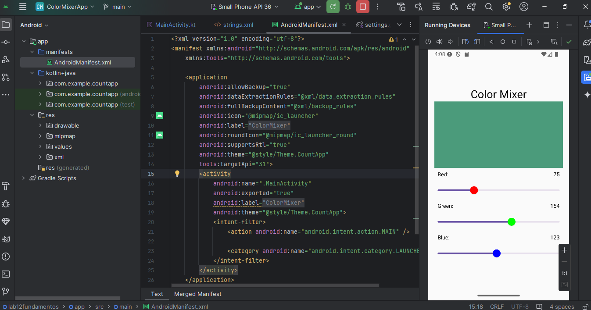

Para correr el programa simplemente hay que clonar el repositorio y abrir la carpeta con AndroidStudio
Si el programa da error, Probar con Sync Proyect with Gradle files

Posterior a eso ya se puede correr la app, al mover las tres barras que estan en la app deberia biar el color del cuadro de en medio

Ejemplo de la app en ejecucion:

Video demo: https://drive.google.com/file/d/1DeLOt6tFAEt8zUMbynXV3c5qCX3GopCo/view?usp=sharing